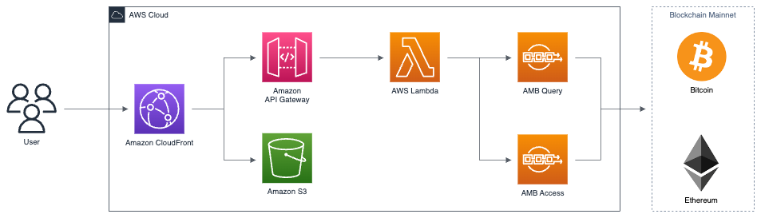

# Web3 wallet Workshop

The purpose of this workshop is for learning how to use Amazon Managed Blockchain Query. For workshop, The participants of workshop could use simple wallet app which applied AMB Query.


## To be done

List of required changes/optimizations:

1. API design
2. API implement
3. Frontend development
4. Address Management(Faucet/etc)
5. Still have some todos in the code... (tbd)

## Workshop Overview

* Create IAM Role with inline policy
* Create KMS/Secret Manager for Bitcoin/Ethereum Address and secret
* Generate Address and fill the crypto/token/NFT
* Clone wallet app and deploy
* Using chainquery API in wallet app

## Development

### Prerequisites

* An AWS account
* An AWS Identity and Access Management (IAM) user with administrator access
* Configured AWS credentials
* [Node.js](https://nodejs.org/en/download/)
  , [Python 3.9](https://www.python.org/downloads/release/python-3916)
  and [pip](https://pip.pypa.io/en/stable/installing/)
  installed on the workstation that you plan to deploy the solution from.

### Deploy Wallet App

* Wallet source clone in your cloud9

   ```shell
   git clone git@ssh.gitlab.aws.dev:blockchain-tfc/web3-wallet-workshop.git
   ```

* Dependency install

   ```shell
   cd frontend
   npm install
   ```

* Hosting by using s3 and cloudfront procedure. first Amplify CLI install 

   ```shell
   curl -sL https://aws-amplify.github.io/amplify-cli/install | bash && $SHELL
   ```

* Amplify init

   ```shell
   cd frontend
   amplify init
   ```

* Amplify hosting

   ```shell
   amplify add hosting
   amplify publish
   ```
After deploy, you can use the cloudfront as wallet app url.

If you want to start on cloud9, you can use below command. 

* Start app from cloud9

   ```shell
   npm run start
   ```


### Install Workshop project to lauch wallet

Install one more project to open a browser suitable for the mobile window size.

* Move to other frontend folder and install dependency

   ```shell
   cd ..
   cd main-front
   npm install
   ```

* Start an another frontend app

  ```shell
   npm run start
   ```

You can paste the cloudfront address of the wallet app on the new frontend app window.


## Architecture

This is simple architecture for web3 wallet workshop. The wallet adopts serverless architecture. We prepared front-end javascript code with React and would publish with `AWS Amplify`. `AWS Amplify` lets web and mobile developers easily build, ship, and host full-stack applications on AWS.
React will request wallet's backedn APIs to `Amazon API Gateway`. `Amazon API Gateway` triggers `AWS Lambda` that analizes request and assembles response. Depending on the usage scenario, lambda invokes methods to `AMB Query`. `AMB Query` returns standardized formatted blochchain data.



In this workshop, we ommits authorization & authetication process to simplify the usage scenario.


## Usage Scenario

### All balances of multiple blockchain

Let's suppose that you have a wallet. When you open wallet, you would want to know how much balances you have. It's like checking the balance of accounts that are distributed and deposited across multiple bank accounts. In blockchain terms, each account address can be said to be the address of multiple blockchain mainnets. If you operate multiple blockchain mainnets, you have to make multiple queries to get the balace for each mainnet seperatively. 

AMB Query returns consolidated results of multiple blockchain mainnnet by at once. You can get not only native coin balance but also smart contract's balances, such as ERC-20, 721, 1155.

#### API GW Spec: `GET /wallet/step0/{addresses}`

This PoC API returns address's native coin balance. If you insert list of addresses, sperated with `&`, it returns balaces of each native coin. As a limitation, this POC only retrieves native coin's balance.


### List of tokens on a certain mainnet

... description

#### API GW Spec: `GET /wallet/step1/{address}`


### Lists of transactions

... description

#### API GW Spec: `GET /wallet/step2/{network}/{address}`

### Details of the transaction

#### API GW Spec: `GET /wallet/step3/{network}/{address}`


## Under the Hood

PoC's lambda utilizes AMB query for each API GW's triggering events. In PoC, we build with python, you can use other programming lanage, even if AWS CLI. Let's query with famous figure's address. 

boto3 also supports AMB's new service, AMB Query.
```python
import boto3
query = boto3.client("managedblockchain-query")
```

Please attach proper IAM policy to your role before accessing.

```
{
    "Version": "2012-10-17", 
    "Statement": [ 
        {
            "Sid" : "AMBQueryAccessPolicy", 
            "Effect": "Allow", 
            "Action": [ 
                "managedblockchain-query:*" 
            ], 
            "Resource": "*"
        }
    ]
}
```


### Get Balances


```python
query.get_token_balance(tokenIdentifier={"network":"BITCOIN_MAINNET", "tokenId":"btc"}, ownerIdentifier={"address":"1A1zP1eP5QGefi2DMPTfTL5SLmv7DivfNa"})

{
    'ResponseMetadata': {
        'HTTPStatusCode': 200, 
        'HTTPHeaders': 
        ...
    }, 
    'ownerIdentifier': {
        'address': '1A1zP1eP5QGefi2DMPTfTL5SLmv7DivfNa'
    }, 
    'tokenIdentifier': {
        'network': 'BITCOIN_MAINNET', 
        'tokenId': 'btc'
    }, 
    'balance': '72.66900535', 
    'atBlockchainInstant': {
        'time': datetime.datetime(2023, 8, 2, 22, 15, 12, tzinfo=tzlocal())
    }, 
    'lastUpdatedTime': {
        'time': datetime.datetime(2023, 8, 1, 19, 1, 26, tzinfo=tzlocal())
    }
}

```

If you want to get balances of bitcoin and ethreum at once, you can use `batch_get_token_balance` from boto3.


 
### GetToken

* ERC20
   ```shell
   $ aws chainquery get-token —token-identifier '{"network":"ETHEREUM_MAINNET","contractAddress":"0xdac17f958d2ee523a2206206994597c13d831ec7"}'
   ```

* ERC721
   ```shell
   $ aws chainquery get-token —token-identifier '{"network":"ETHEREUM_MAINNET","contractAddress":"0xf07468ead8cf26c752c676e43c814fee9c8cf402","tokenId":"1817"}'
   ```

### GetAssetContract

   ```shell
   $ aws chainquery get-asset-contract —contract-identifier '{"network":"ETHEREUM_MAINNET","contractAddress":"0xdac17f958d2ee523a2206206994597c13d831ec7"}'
   ```

### GetTransaction

```shell
$ aws chainquery get-transaction —network ETHEREUM_MAINNET —transaction-hash 0x823939f87e3dc70acb020b2b65d66821ab092729c2ad3acefa7fc7ed28f9a0ba
```

```json
{
    "transaction": {
        "network": "ETHEREUM_MAINNET",
        "blockHash": "0xfb6725a610b08ea5cf61a14154587ce52919b95e4431f0caca6a9a087cb7509b",
        "transactionHash": "0x823939f87e3dc70acb020b2b65d66821ab092729c2ad3acefa7fc7ed28f9a0ba",
        "blockNumber": "12751391",
        "transactionTimestamp": "2021-07-03T09:19:49+09:00",
        "transactionIndex": 52,
        "numberOfTransactions": 166,
        "status": "FINAL",
        "to": "0xf07468ead8cf26c752c676e43c814fee9c8cf402",
        "from": "0x0abb75f676d0c131c04324dd98150a39213edd41",
        "gasUsed": "1273443",
        "cumulativeGasUsed": "5349307",
        "effectiveGasPrice": "15000000000",
        "signatureV": 38,
        "signatureR": "0xf7b18a131f5b5d2262da1f1717dbd7e56b89ac9c45c4d9c19d9521450e64c9be",
        "signatureS": "0x479fe8615149e9214f3d703b2ab9e923c75e56459905b089d57b9423ffdd8c12"
    }
}
```

### ListAssetContract

* ERC20

```shell
$ aws chainquery list-asset-contracts —contract-filter '{"network":"ETHEREUM_MAINNET","contractStandard":"ERC20","deployerAddress":"0x36928500bc1dcd7af6a2b4008875cc336b927d57"}'
```
```json
{
"contracts": []
}
```

* ERC721
```shell
$ aws chainquery list-asset-contracts —contract-filter '{"network":"ETHEREUM_GOERLI","contractStandard":"ERC721","deployerAddress":"0xbf5ae7576440f72f08cd61e43b16b035a6e07641"}'
```
```json
{
"contracts": []
}
```

### ListTokenBalance

```shell
$ aws chainquery list-token-balances —token-filter '{"network":"ETHEREUM_MAINNET","contractAddress":"0x5cc5b05a8a13e3fbdb0bb9fccd98d38e50f90c38","tokenId":"157639"}'
```
```json
{
    "tokenBalances": [
        {
            "ownerIdentifier": {
                "address": "0x0000000000000000000000000000000000000000"
            },
            "tokenIdentifier": {
                "network": "ETHEREUM_MAINNET",
                "contractAddress": "0x5cc5b05a8a13e3fbdb0bb9fccd98d38e50f90c38",
                "tokenId": "157639"
            },
            "balance": "-1",
            "atBlockchainInstant": {
                "time": "2023-07-14T14:36:15+09:00"
            }
        },
        {
            "ownerIdentifier": {
                "address": "0xb27abad819ec07f16c4e248f0cf956e7b5c1e2bd"
            },
            "tokenIdentifier": {
                "network": "ETHEREUM_MAINNET",
                "contractAddress": "0x5cc5b05a8a13e3fbdb0bb9fccd98d38e50f90c38",
                "tokenId": "157639"
            },
            "balance": "1",
            "atBlockchainInstant": {
                "time": "2023-07-14T14:36:15+09:00"
            }
        }
    ]
}
```

* ERC721
```shell
$ aws chainquery list-token-balances —token-filter '{"network":"ETHEREUM_GOERLI","contractAddress":"0xbf5ae7576440f72f08cd61e43b16b035a6e07641","tokenId":"1"}'
```
```json
{
    "tokenBalances": [
        {
            "ownerIdentifier": {},
            "tokenIdentifier": {
                "network": "ETHEREUM_GOERLI",
                "contractAddress": "0xbf5ae7576440f72f08cd61e43b16b035a6e07641",
                "tokenId": "1"
            },
            "balance": "1",
            "atBlockchainInstant": {
                "time": "2023-07-14T14:37:30+09:00"
            }
        },
        {
            "ownerIdentifier": {
                "address": "0xdce9843a0a3336f747a22f163da57fe18203b064"
            },
            "tokenIdentifier": {
                "network": "ETHEREUM_GOERLI",
                "contractAddress": "0xbf5ae7576440f72f08cd61e43b16b035a6e07641",
                "tokenId": "1"
            },
            "balance": "1",
            "atBlockchainInstant": {
                "time": "2023-07-14T14:37:30+09:00"
            }
        }
    ]
}
```

## ListTransactionEvents

```shell
$ aws chainquery list-transaction-events —network ETHEREUM_MAINNET —transaction-hash 0x823939f87e3dc70acb020b2b65d66821ab092729c2ad3acefa7fc7ed28f9a0ba
```
```json
{
    "events": [
        {
            "network": "ETHEREUM_MAINNET",
            "transactionHash": "0x823939f87e3dc70acb020b2b65d66821ab092729c2ad3acefa7fc7ed28f9a0ba",
            "eventType": "ERC721_TRANSFER",
            "to": "0x0abb75f676d0c131c04324dd98150a39213edd41",
            "value": "1",
            "contractAddress": "0xf07468ead8cf26c752c676e43c814fee9c8cf402",
            "tokenId": "4268"
        },
        {
            "network": "ETHEREUM_MAINNET",
            "transactionHash": "0x823939f87e3dc70acb020b2b65d66821ab092729c2ad3acefa7fc7ed28f9a0ba",
            "eventType": "ERC721_TRANSFER",
            "to": "0x0abb75f676d0c131c04324dd98150a39213edd41",
            "value": "1",
            "contractAddress": "0xf07468ead8cf26c752c676e43c814fee9c8cf402",
            "tokenId": "9250"
        },
        {
            "network": "ETHEREUM_MAINNET",
            "transactionHash": "0x823939f87e3dc70acb020b2b65d66821ab092729c2ad3acefa7fc7ed28f9a0ba",
            "eventType": "ERC721_TRANSFER",
            "to": "0x0abb75f676d0c131c04324dd98150a39213edd41",
            "value": "1",
            "contractAddress": "0xf07468ead8cf26c752c676e43c814fee9c8cf402",
            "tokenId": "9579"
        },
    ...
```


```shell
$ aws chainquery list-transaction-events —network ETHEREUM_MAINNET —transaction-hash 0x6eaf94b00b7d859eeb21d59cf5709a6ad199265418c3b91769c0e6ef46ad6a60
```
```json
{
    "events": [
        {
            "network": "ETHEREUM_MAINNET",
            "transactionHash": "0x6eaf94b00b7d859eeb21d59cf5709a6ad199265418c3b91769c0e6ef46ad6a60",
            "eventType": "ETH_TRANSFER",
            "from": "0x843b3b32ba25b8d99ffb01007ef7e625c4f68231",
            "to": "0xfe7a6dfc7630eb86d1ba2a5113f4db2c56d7c884",
            "value": "60000000000000000",
            "tokenId": "eth"
        },
        {
            "network": "ETHEREUM_MAINNET",
            "transactionHash": "0x6eaf94b00b7d859eeb21d59cf5709a6ad199265418c3b91769c0e6ef46ad6a60",
            "eventType": "INTERNAL_ETH_TRANSFER",
            "from": "0xfe7a6dfc7630eb86d1ba2a5113f4db2c56d7c884",
            "to": "0xcfc0f98f30742b6d880f90155d4ebb885e55ab33",
            "value": "60000000000000000",
            "tokenId": "eth"
        }
    ]
}
```

```shell
$ aws chainquery list-transaction-events —network ETHEREUM_MAINNET —transaction-hash 0x6582113c651d7892978f697ab80f242b7fc86a89637a53f564bf022d6314909c
```
```json
{
    "events": [
        {
            "network": "ETHEREUM_MAINNET",
            "transactionHash": "0x6582113c651d7892978f697ab80f242b7fc86a89637a53f564bf022d6314909c",
            "eventType": "ETH_TRANSFER",
            "from": "0xb739d0895772dbb71a89a3754a160269068f0d45",
            "to": "0x97ca3023ffc4b0ef4bbbdc6d3c8b6556741a26eb",
            "value": "1078645000000000",
            "tokenId": "eth"
        }
    ]
}
```

## ListTransactions

```shell
$ aws chainquery list-transactions —network ETHEREUM_MAINNET —address 0xab5801a7d398351b8be11c439e05c5b3259aec9b
```
```json
{
    "transactions": [
        {
        "transactionHash": "0xf7dbf98bcebd7b803917e00e7e3292843a4b7bf66016638811cea4705a32d73e",
        "network": "ETHEREUM_MAINNET",
        "transactionTimestamp": "2015-09-09T21:11:14+09:00"
        },
        {
        "transactionHash": "0x13ae555f06f0ed867514eade329fa7bd439fa568855c0de8939557a949b4de30",
        "network": "ETHEREUM_MAINNET",
        "transactionTimestamp": "2015-09-09T21:17:35+09:00"
        },
        {
        "transactionHash": "0x0d26b1539304a214a6517b529a027f987cd52e70afd8fdc4244569a93121f144",
        "network": "ETHEREUM_MAINNET",
        "transactionTimestamp": "2015-09-09T21:21:43+09:00"
        },
        {
        "transactionHash": "0x88bf7a2d565daac6a9528bc2ea7c8efa03d66f90ff287f376b2eda38f0376240",
        "network": "ETHEREUM_MAINNET",
        "transactionTimestamp": "2015-09-16T01:04:32+09:00"
        },
        {
        "transactionHash": "0xeaa0d65de15a980b0d42d8c10efa18460cd3757836652d9ab3d915c32ed0b043",
        "network": "ETHEREUM_MAINNET",
        "transactionTimestamp": "2015-11-20T16:52:15+09:00"
        },
....
```